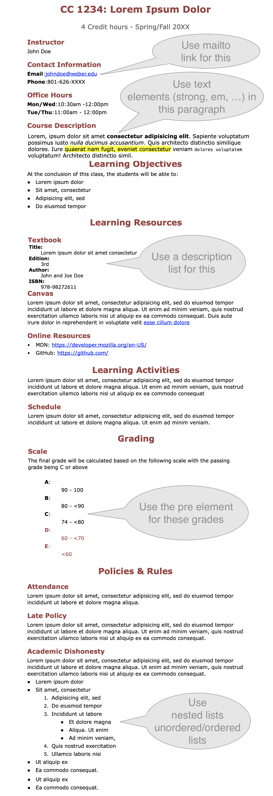

# Recreating a course syllabus

Recreate the sample syllabus below using HTML and internal CSS (Place all your CSS rules within a \<style\> tag inside the \<head\> element of your HTML document). Use id's, classes, and element selectors to link your CSS rules to your HTML elements. Follow the instructions in the comment boxes. You may choose different fonts, and colors. Make sure to organize your HTML using semantic tags. You may use dummy URL for links.

Name your HTML document syllabus.html, validate it at https://validator.w3.org/#validate_by_upload (Links to an external site.), and submit it via Canvas.

