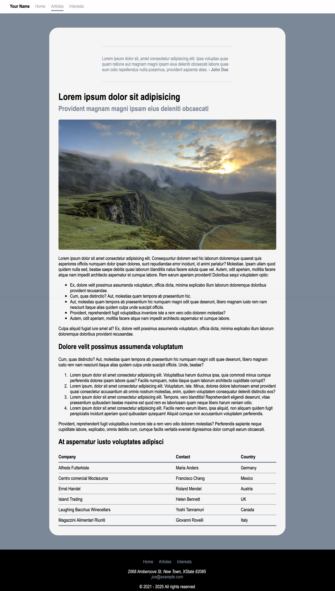

# Assignment 3- Recreating a sample page

**Due: Feb 16, 2022 at 11:59pm**

Recreate the sample site below using HTML and internal CSS (Place all your CSS rules in an internal \<style\>\</style\> element under the page \<head\> element).

Your implementation should be as close to the sample page as possible. For images, link to https://unsplash.com (Links to an external site.). Make sure to organize your HTML using semantic tags and to have a clean properly indented HTML and CSS code. Validate your HTML pages at https://validator.w3.org/#validate_by_upload (Links to an external site.).

Submit your .html file via Canvas.

