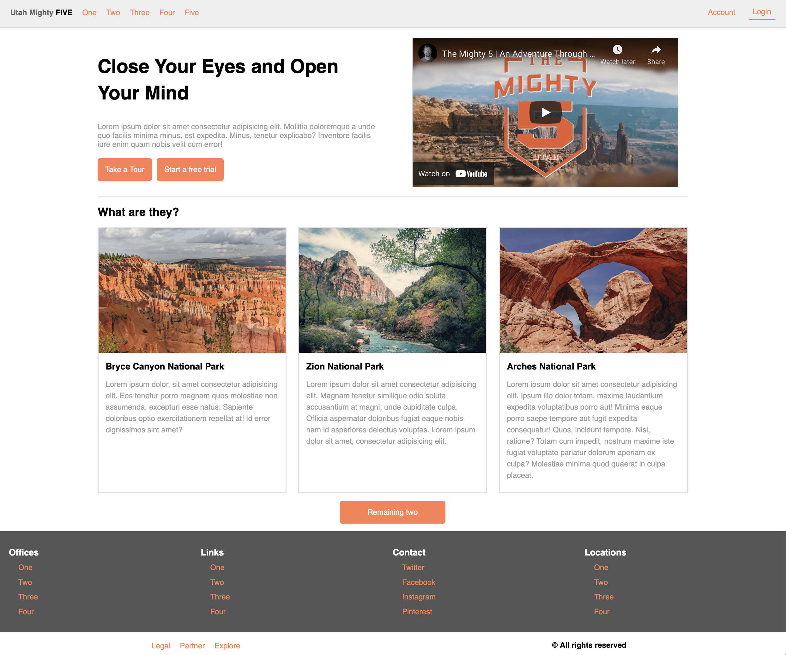

# Assignment 4 - Landing page layout

**Due: Feb 23, 2022 at 11:59pm**

Recreate the sample landing page below using HTML and CSS. You may choose different fonts and colors. Follow these instructions to do so:

-   Place all your CSS rules internally within a `<style>` tag inside the `<head>` element of your HTML document.
-   Make sure to organize your HTML using semantic tags.
-   Use unordered lists for both the top nav menu and the links at the bottom.
-   Pay attention to the fact that some parts of the page are centered with the remaining width space divided equally between left and right and some expand to take the whole width.
-   Embed a YouTube video that is the same or similar to the one you see in the screen below.
-   Link to images from [https://unsplash.com/](https://unsplash.com) (Links to an external site.). Make sure that each image has an alt description.
-   For buttons, use the `` tag and style it look like a button.

Name your HTML document index.html, validate it at [https://validator.w3.org/#validate_by_upload](https://validator.w3.org/#validate_by_upload) (Links to an external site.), and submit it via Canvas.

