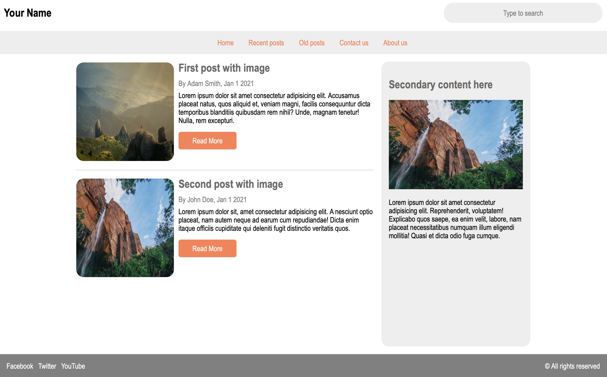
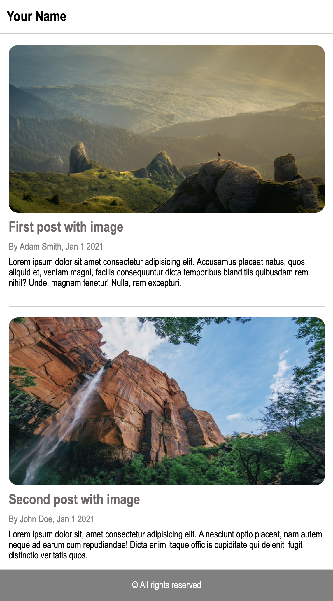

# Assignment 5 - Page layout with Flexbox

**Due: Mar 2, 2022 at 11:59pm**

Recreate the sample blog landing page below using Flexbox:

-   Use a breakpoint to make your page look like the second image on a mobile screen (< 500px).
-   Place all your CSS rules within a `<style>` tag inside the `<head>` element of your HTML document. Don't use an external CSS file.
-   Include the robots and description meta tags
-   Organize your HTML using semantic tags.
-   You may used different colors and images (link to [https://unsplash.com](https://unsplash.com) (Links to an external site.)).

Name your HTML document **index.html**, validate it at [https://validator.w3.org/#validate_by_upload](https://validator.w3.org/#validate_by_upload) (Links to an external site.), and submit it via Canvas.

**HINT:** Use a mobile-first approach.

## Desktop version

## Mobile version

