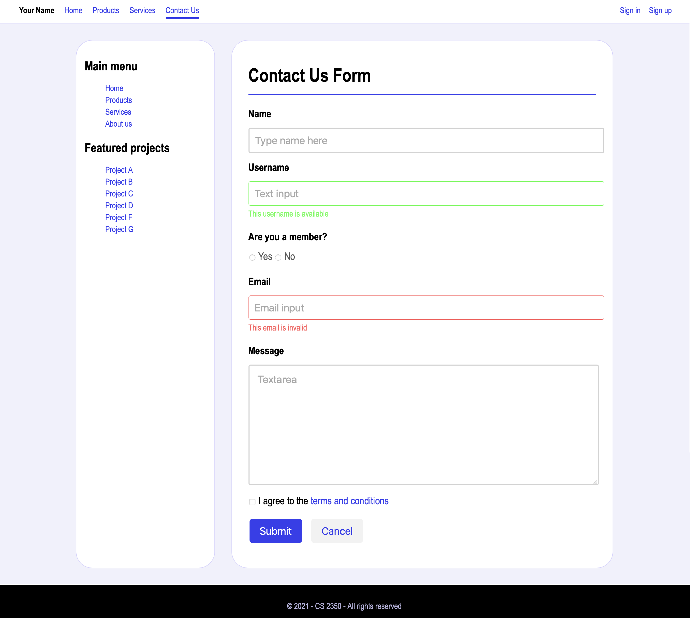

# Assignment 6 - A simple form

Due: Mar 9, 2022 at 11:59pm

Recreate the simple form below. Place all your CSS rules within a \<style\> tag inside the \<head\> element of your HTML document. Make sure to organize your HTML using semantic tags.

Name your HTML document **index.html**, validate it at https://validator.w3.org/#validate_by_upload (Links to an external site.), and submit it via Canvas.

